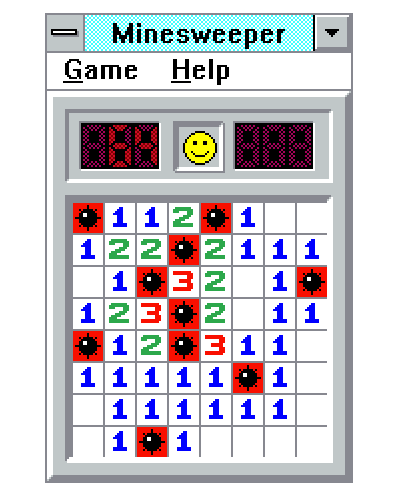

#   Minesweeper (Human & AI Player)

## Introduction
You are bored at your office and would like to play a good old windows 98 game ? Here comes Minesweeper ! You can play it or watch an artificial intelligence do the risky job for you ! Enjoy 🎮

## Illustration


## Installation

- First of all, it is **required** to install gcc on your computer (installed by default on MAC). If it nos already done, you can do it using the following [link](https://www.scaler.com/topics/c/c-compiler-for-windows/).

- Then, starting from the root of the folder, compile the code using the command:

```
gcc -o minesweeper code/minesweeper.c code/grid.c code/engine.c code/solver.c
```

## Playing

You are almost ready to play ! Indeed, starting from the root of the folder, run the following command:

```
./minesweeper <width> <height> <number of bombs> <player>
```

where,

```
- <width>            : int in [0, 1000]
- <height>           : int in [0, 1000]
- <number of bombs>  : int in [0, (w * h) - 1]
- <player>           : 0 = Heuristic
                       1 = Human
```

For example, if you want to watch our artificial intelligence play on a minefield of 100 x 100 tiles with 500 bombs, you can simply use the following command:

```
./minesweeper 100 100 500 0           
```


Enjoy the game ! 🚏


